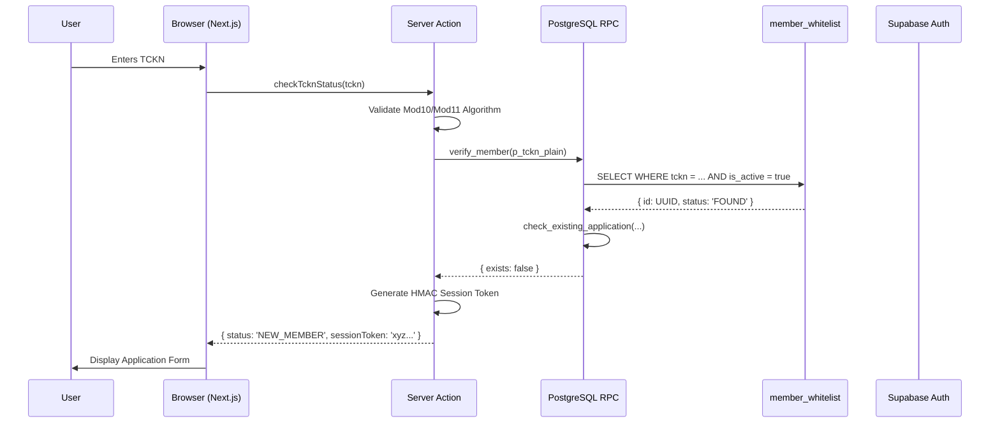
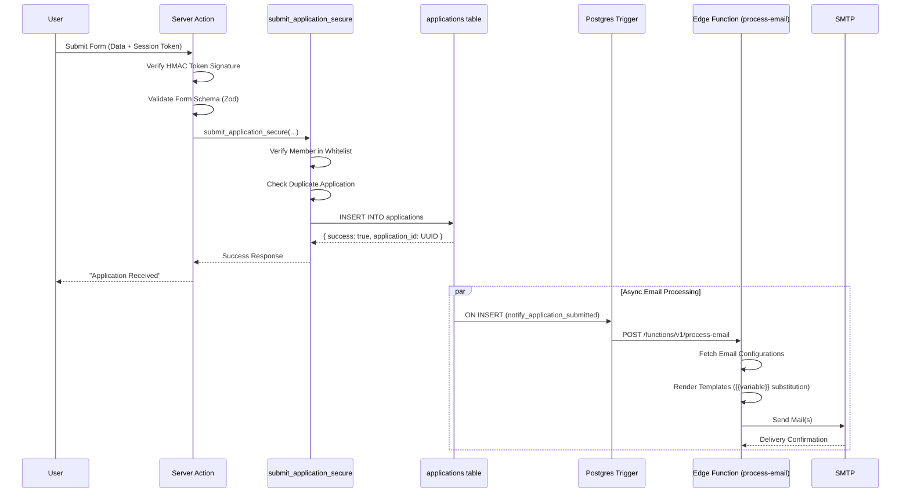
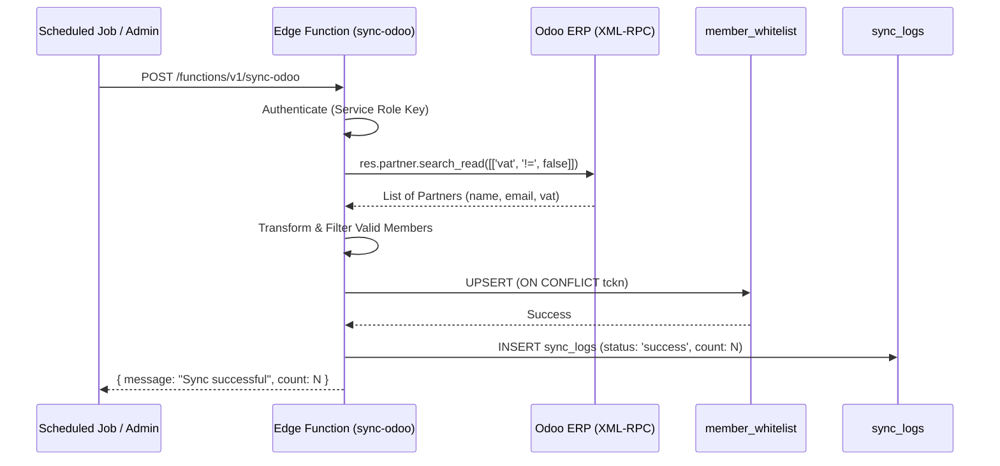
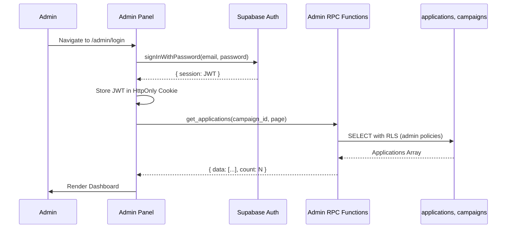
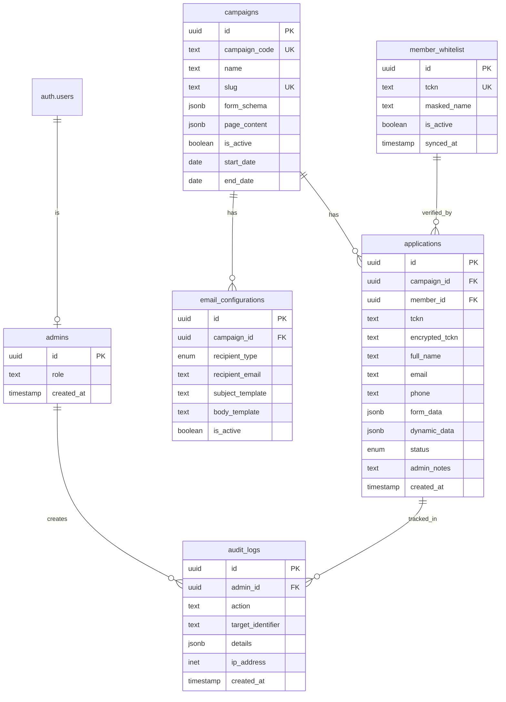

# Architecture Overview

## High-Level System Design

The Member Verification System follows a **Serverless / JAMstack** architecture pattern, leveraging Next.js for the frontend and Supabase for backend infrastructure. The application is designed to be stateless on the application layer, with Supabase (PostgreSQL) serving as the single source of truth for all state and business logic.

### Architecture Pattern: Thick Database, Thin API

The system implements a "thick database, thin API" philosophy where:
- **Business logic** resides primarily in PostgreSQL functions (RPC, triggers, constraints)
- **Application layer** acts as a thin orchestration layer
- **Security** is enforced at the database level via Row-Level Security (RLS)
- **Data integrity** is maintained through database constraints and triggers

## System Components

### 1. Frontend Layer: Next.js 16 (App Router)

**Hosting**: Vercel (recommended) or Docker Container

**Rendering Strategy**:
- **Server Components (RSC)**: Fetch campaign configurations, page content, and metadata directly from database during SSR/SSG
- **Client Components**: Handle form interactivity (`DynamicForm`), validation, real-time UI updates
- **Server Actions**: Execute business logic server-side (TCKN validation, application submission) while keeping API keys secure

**Key Characteristics**:
- Hybrid rendering for optimal SEO and performance
- Type-safe with TypeScript throughout
- Zero-config routing via App Router file structure
- Built-in API routes for authentication flows

### 2. Backend Layer: Supabase

**Database: PostgreSQL 17**
- **Extensions**: `uuid-ossp`, `pgcrypto` (for hashing/encryption)
- **RLS**: Row-Level Security policies enforce data access at the database level
- **Functions**: PL/pgSQL functions (`SECURITY DEFINER`) for business logic
- **Triggers**: Database triggers for webhook notifications and audit logging

**Authentication: Supabase Auth**
- JWT-based authentication for admin panel
- Email OTP for member verification flow
- Role-based access control (admin/viewer roles)

**Edge Functions: Deno Runtime**
- `process-email`: Webhook-triggered email sender
- `sync-odoo`: Scheduled/manual Odoo ERP synchronization
- Serverless execution with automatic scaling

### 3. External Services

**Odoo ERP**
- Source of truth for member whitelist
- XML-RPC API integration
- Scheduled synchronization via Edge Function

**SMTP Server**
- Configurable SMTP provider (Gmail, SendGrid, etc.)
- Transactional email delivery via Nodemailer
- Template-based email generation with variable substitution

**Optional: Redis**
- Planned for stricter rate limiting (currently using PostgreSQL-based rate limiting)

## Data Flow Architecture

### 1. Member Verification Flow

### 2. Application Submission Flow

### 3. Odoo Synchronization Flow

### 4. Admin Dashboard Flow

## Database Schema Relationships

## Security Architecture

### 1. Row-Level Security (RLS)

All tables have RLS enabled with policies enforcing:

- **Public Access**: Read-only access to active campaigns, TCKN verification (via RPC)
- **Authenticated Access**: Admin-only access to applications, campaigns management
- **Service Role**: Bypasses RLS for Edge Functions and migrations

### 2. Authentication & Authorization

**Admin Panel**:
- Supabase Auth (email/password)
- JWT tokens stored in HttpOnly cookies
- Role-based access: `admin` (full access) vs `viewer` (read-only)

**Member Verification**:
- Email OTP via Supabase Auth
- HMAC session tokens for form submission (15-minute expiration)
- TCKN validation prevents invalid submissions

### 3. Data Protection

- **TCKN Storage**: Currently plaintext (per business requirement), schema supports encryption
- **Session Tokens**: HMAC-SHA256 signed with `SESSION_SECRET`
- **Rate Limiting**: IP-based, endpoint-specific limits (PostgreSQL table)
- **Audit Logging**: All sensitive operations logged to `audit_logs`

## Infrastructure & Deployment

### Development Environment

- **Local Supabase**: `npx supabase start` (Docker containers)
- **Frontend**: `npm run dev` (Next.js dev server)
- **Edge Functions**: `npx supabase functions serve` (local Deno runtime)

### Production Environment

- **Frontend**: Vercel (recommended) or Docker container
- **Backend**: Supabase Cloud (managed PostgreSQL + Edge Functions)
- **CDN**: Vercel Edge Network (automatic)
- **Database**: Supabase PostgreSQL (managed, automated backups)

### CI/CD Pipeline

1. **GitHub Actions** (or similar):
   - Run `npm run lint` and `npm run type-check` on PRs
   - Run `npm run test` (unit tests)
   - Run `npm run test:e2e` (Playwright E2E tests)

2. **Vercel**:
   - Automatic deployment on `main` branch push
   - Preview deployments for PRs
   - Environment variable injection

3. **Supabase**:
   - Migrations applied via CLI or dashboard
   - Edge Functions deployed via `supabase functions deploy`

## Performance Considerations

- **Database Indexing**: Strategic indexes on `tckn`, `campaign_id`, `status`, `created_at`
- **Query Optimization**: RPC functions use `SECURITY DEFINER` to bypass RLS overhead
- **Caching**: Next.js Data Cache for campaign configurations (revalidated via tags)
- **Edge Functions**: Stateless, auto-scaling Deno runtime
- **Rate Limiting**: Prevents abuse at the database level

## Scalability

- **Horizontal Scaling**: Stateless application layer (Next.js) scales horizontally
- **Database**: Supabase managed PostgreSQL with connection pooling
- **Edge Functions**: Automatic scaling based on request volume
- **CDN**: Vercel Edge Network for static assets and API routes

## Monitoring & Observability

- **Supabase Dashboard**: Database metrics, query performance, Edge Function logs
- **Vercel Analytics**: Frontend performance, error tracking
- **Application Logs**: Structured logging via `lib/logger.ts`
- **Audit Trail**: `audit_logs` table tracks all sensitive operations

---

**Next**: See [BACKEND.md](./BACKEND.md) for detailed database schema and business logic documentation.
